- Sencillo **gestor de contraseñas** desarrollado en **C# y WPF**.
- Contiene encriptación básica, persistencia de datos y diseño en UI/UX.

---

## 📸 Capturas

---

## ✨ Características

- ✔ **Inicio de sesión seguro**
  - Contraseña protegida mediante **hash + salt**.
  - Si es el primer uso, el usuario crea su contraseña maestra.

- ✔ **Gestión de contraseñas**
  - Guarda sitios, usuarios y contraseñas.
  - Oculta/Muestra contraseña con un clic.
  - Elimina registros fácilmente.

- ✔ **Interfaz moderna**
  - Ventanas sin borde.
  - Esquinas redondeadas.
  - Colores estilo *Visual Studio / Fluent Dark*.

- ✔ **Generador de contraseñas aleatorias**
  - Contraseñas seguras con un botón.

- ✔ **Datos almacenados localmente**
  - Las contraseñas se guardan en un archivo JSON.
  - La contraseña maestra se almacena **hasheada**, nunca en texto plano.

---

## 🛠️ Tecnologías utilizadas

- **WPF (.NET Framework / .NET Core)**
- **C#**
- `SHA256` + salt para proteger la clave maestra
- Archivos JSON para persistencia
- XAML para la interfaz y estilos personalizados
